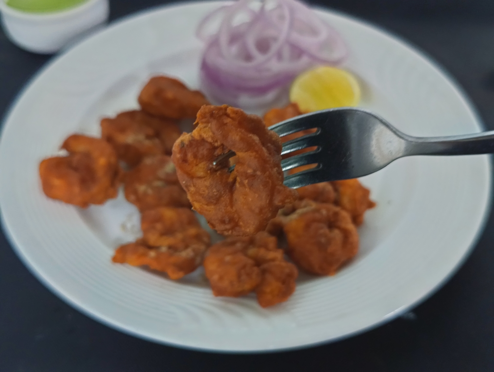

# Prawns-koliwada-
Prawns koliwada recipe 

# prawns koliwada Recipe

A simple and delicious homemade prawns koliwada recipe.

## Ingredients

- 12 medium size prawns 
- 1 tablespoon ginger garlic paste 
- 1 tablespoon Red chilli powder 
- 1/2 tablespoon green chilli paste 
- 1/2 tablespoon garam masala 
- 1 teaspoon turmeric powder 
- 1 teaspoon chat masala
- 1/4 teaspoon carron seeds
- 2 tablespoon corn flour
- 4 tablespoon gram flour
- 2 lemon wedges
- cooking oil for frying 

## Instructions

1. Peel, clean and devein the prawns. Wash them under running water and pat them dry completely.
2. Take the prawns in a mixing bowl, add half of the ginger garlic paste, turmeric powder,  half of the green chilli paste, juice from one lemon wedge and a small pinch of salt.
3. Give them a good mix and keep aside for 5 minutes to absorb the flavours.
4. After That add red chilli powder, carom seeds, corn flour, gram flour, chat masala, green chilli paste, salt as per taste and lemon juice.
5. Start mixing everything to coat the prawn evenly from all sides. Add some water to make the batter smooth. Cover and keep them marinade for 10 minutes.
6. Heat oil in a kadai or pan under medium heat flame fire. When the become hot, lower the gas flame and add the batter coated prawns one by one into the oil carefully.
7. After That add red chilli powder, carom seeds, corn flour, gram flour, chat masala, green chilli paste, salt as per taste and lemon juice.
8. Start mixing everything to coat the prawn evenly from all sides. Add some water to make the batter smooth. Cover and keep them marinade for 10 minutes.
9. Heat oil in a kadai or pan under medium heat flame fire. When the become hot, lower the gas flame and add the batter coated prawns one by one into the oil carefully.
10. Fry them for 5-6 minutes or till become crisp and golden.
11. Remove and serve them hot by sprinkling some chat masala over them.

original recipe with step by step photo and video
[Prawns koliwada]( https://www.hassanchef.com/2023/09/prawns-koliwada-recipe.html)
